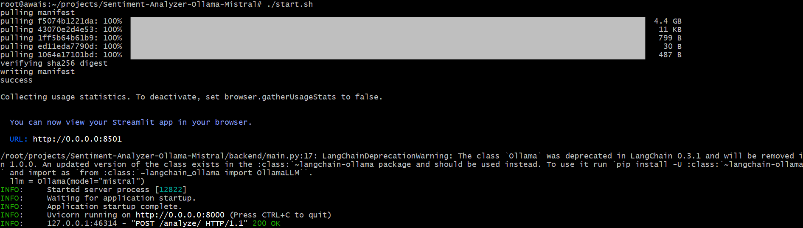
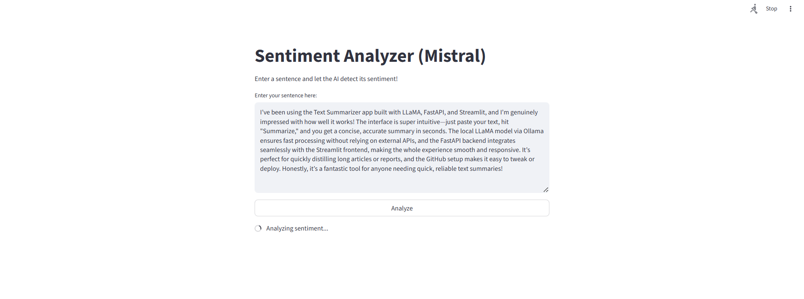
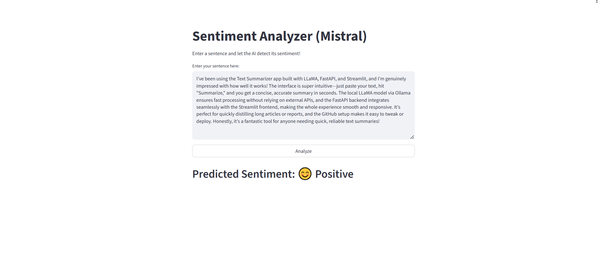

# Sentiment Analyzer (Mistral)

A simple AI app that uses the **Mistral model** via Ollama to classify the sentiment of text.

## Features

- **FastAPI** backend
- **Streamlit** frontend
- **Ollama-hosted Mistral model**
- **LangChain integration**

## 🚀 Quick Start

### 1. Install Ollama

Download and install Ollama from https://ollama.com and make sure it is running on your device.

### 2. Clone the repo

```
git clone https://github.com/yourusername/sentiment-analyzer-mistral.git
cd sentiment-analyzer-mistral
```

### 3. Install dependencies

```
pip install -r requirements.txt
```

### 4. Run the app

```
./start.sh
```

This script will:

- Ensure the Mistral model is downloaded
- Start the backend and frontend in parallel

## 🐳 Docker

You can also run everything in Docker:

```
# Build the Docker image
sudo docker build -t sentiment-analyzer-mistral .

# Run the container (make sure Ollama is running on your host!)
sudo docker run --network=host sentiment-analyzer-mistral
```

Note: Ollama must be installed and running on your host machine. The Docker container expects to connect to Ollama at localhost:11434.

## 🧪 Running Tests

To run all backend and frontend tests:

```
pytest tests/
```

## 🛠️ Backend (FastAPI)

- Handles sentiment analysis requests by talking to the Mistral model via LangChain and Ollama.
- Runs on http://localhost:8000
- Endpoint: `/analyze/`



## 🎨 Frontend (Streamlit)

- User-friendly interface for entering text and viewing sentiment.
- Runs on http://localhost:8501





## 📦 Project Structure

```

```
